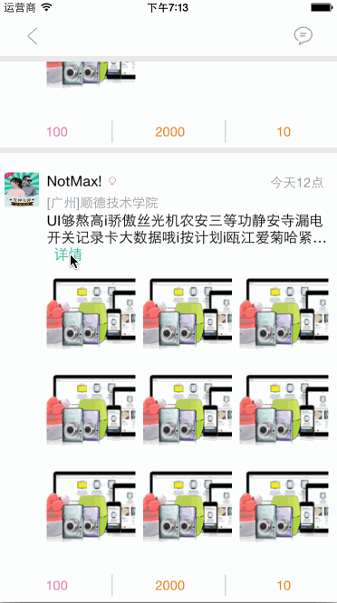

  NavigationBar随着滚动透明度变化，以及左右按钮的图标及头像更改动画，类似于美丽说APP的设计师店铺首页效果。其中还有项目中使用的文字展开收起的Cell，以及一个毛玻璃弹出框例子。 
        注：代码没有怎么优化，也没有把View彻底分开，仅供参考。

# AlphaNavigationBar

## 动画示例截图

## 文字展开Cell示例截图

## 毛玻璃弹出框示例截图

## 许可信息

MIT许可，允许使用者自由修改与拷贝，本项目维护者不负任何法律责任，也不承诺提供任何维护支持。
